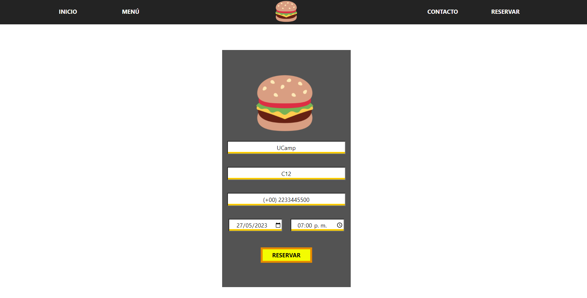

# Proyecto 4 Restaurant App

****

## **ÍNDICE**

* [1. Descripción](#1-descripción)
* [2. Evaluación](#2-evaluación)
* [3. Presentación](#3-Presentación)

---
# 1. Descripción: 

#### Este proyecto está enfocado en construir una aplicación web para un restaurante.

<b>Lo que deberás incluir como requisitos mínimos será:</b>

* Una sección o página sobre información principal del restaurante
* Una sección de formulario de contacto
* Una sección de datos de ubicación y correo electrónico

<b>Como características opcionales:</b>

Un componente que permita reservar una mesa en una hora y fecha específica para un usuario
Un componente que incluya el menú completo del restaurante
Adaptado a móviles
Un blog que incluya un artículo

# 2. Evaluación

| ÁREA       | % DEL TOTAL |
| ------------- |:-------------:|
| UI      | 30%     |
| REACT      | 40%     |
| ALMACENAMIENTO      | 10%     |
| CONTROL DE VERSIONES | 10%      |
| ENTREGA A TIEMPO | 10%      |

# 3. Presentación

### Sección: INICIO

#### Sección: MENÚ

### Sección: CONTACTANOS

### Sección: RESERVAR

* Si no se ingresan todos los datos se aparecerá un “alert”

* Al ingresar todos los campos aparecerá un ID que corresponde a la “reserva” solicitada.

* Se utilizó Firebase para poder almacenar los datos recabados en la sección de “Reserva”

# ANTES DE RESERVAR:

# DESPUÉS DE RESERVAR

* Nótese que el ID es el proporcionado por “Firebase”

### El proyecto cuenta con dos vistas, la vista cambia cuando es menor o mayor a 1200px 

#### Menor a 1200px

#### Mayor o igual a 1200px

